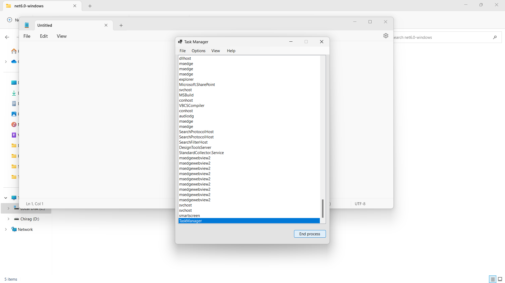

# Task-Manager
Simple Task Manager with End Process and Run New Task

# How to find the Executable File
The Process is Easy Just go to the bin folder and navigate till you reach the TaskManager

# Images

### Open Run New Task

### Run New Task

### End Process

### After Process Ended

